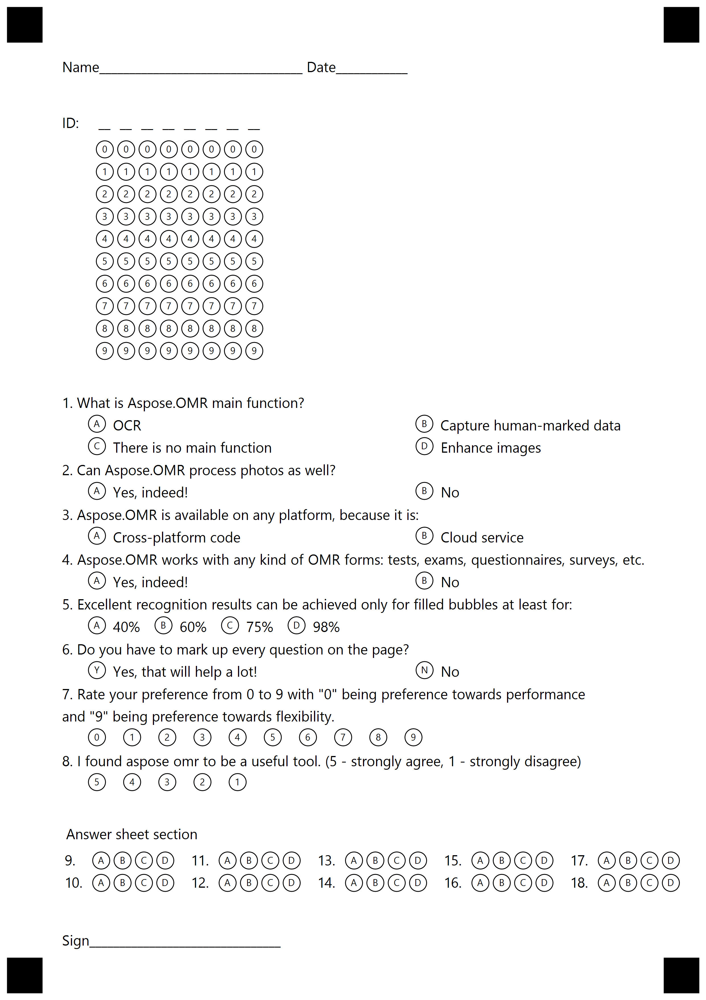
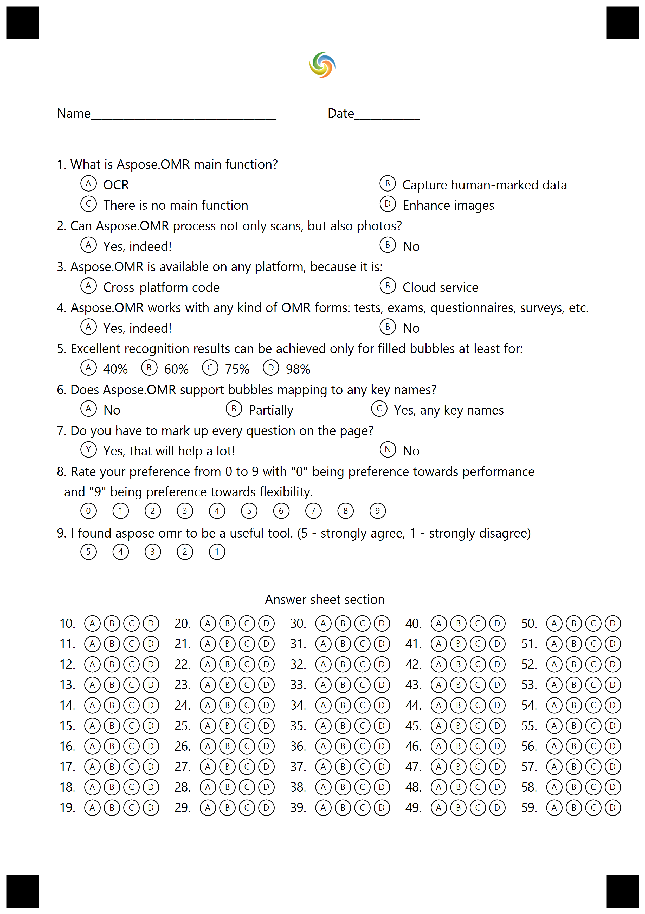
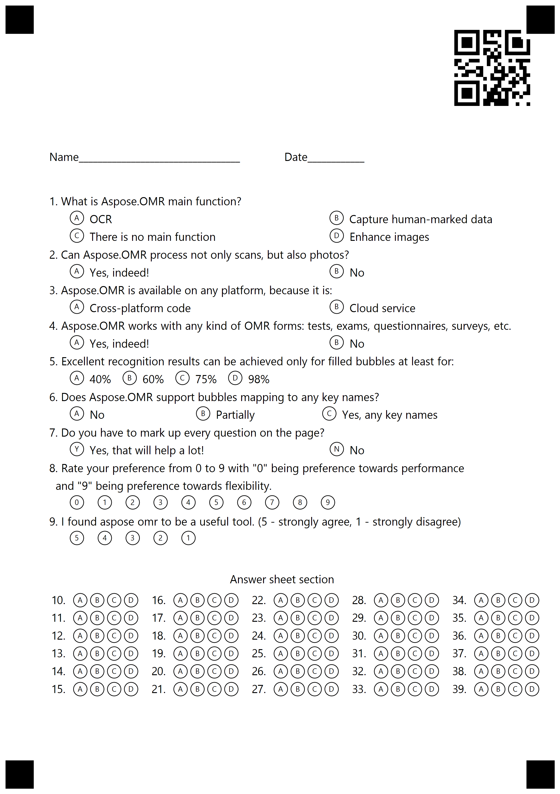

{} 

The template generation requires a valid license. To request a 30 Day Temporary License, please refer to [How to get a Temporary License?](https://purchase.aspose.com/temporary-license)

{} 

In the text markup, all element attribute names are preceded by <**\t**> symbol (tabulation)
# **Create OMR Templates using Text Markup**
Aspose.OMR for .NET provides the option to generate OMR template (.omr) files and images by using simple text markup. The API provides [OmrEngine.GenerateTemplate](https://apireference.aspose.com/net/omr/aspose.omr.api/omrengine/methods/generatetemplate) method that takes the path of the markup text file as a parameter. The [OmrEngine.GenerateTemplate](https://apireference.aspose.com/net/omr/aspose.omr.api/omrengine/methods/generatetemplate) method returns a [GenerationResult](https://apireference.aspose.com/net/omr/aspose.omr.generation/generationresult) object which contains the template image and the template (JSON that describes elements location on the image).

The following is the text markup that is used in the example code snippet to generate the OMR template file.



 ?text=Name__________________________________ Date____________

?grid=ID

 sections_count=8

#What is Aspose.OMR main function?

 () OCR () Capture human-marked data

 () There is no main function () Enhance images

#Can Aspose.OMR process photos as well?

 () Yes, indeed! () No

#Aspose.OMR is available on any platform, because it is:

 () Cross-platform code () Cloud service

#Aspose.OMR works with any kind of OMR forms: tests, exams, questionnaires, surveys, etc.

 () Yes, indeed! () No

#Excellent recognition results can be achieved only for filled bubbles at least for:

 () 40% () 60% () 75% () 98%

#Do you have to mark up every question on the page?

 (Yes) Yes, that will help a lot! (No) No

#Rate your preference from 0 to 9 with "0" being preference towards performance

and "9" being preference towards flexibility.

 (0) (1) (2) (3) (4) (5) (6) (7) (8) (9)

#I found aspose omr to be a useful tool. (5 - strongly agree, 1 - strongly disagree)

 (5) (4) (3) (2) (1)

?text= Answer sheet section

?answer_sheet=MainQuestions

	elements_count=10

	columns_count=5

?text=Sign________________________________



The following code snippet processes the sample text markup to generate the OMR template file and the image of the sheet.



The following is the image generated by the sample code.

# **Save output image as PDF**
By using Aspose.OMR for .NET, you may save the output images generated during the template generation as PDF. To achieve this, the API provides the GenerationResult.SaveAsPdf method. The following code snippet demonstrates the use of the GenerationResult.SaveAsPdf method to save the output image as PDF.


# **Create OMR Templates with images**
Aspose.OMR for .NET provides the option to generate OMR template (.omr) files with images. The API provides an optional parameter for [OmrEngine.GenerateTemplate](https://apireference.aspose.com/net/omr/aspose.omr.api/omrengine/methods/generatetemplate) method that takes a string array of image paths as an optional parameter. The [OmrEngine.GenerateTemplate](https://apireference.aspose.com/net/omr/aspose.omr.api/omrengine/methods/generatetemplate) method returns a [GenerationResult](https://apireference.aspose.com/net/omr/aspose.omr.generation/generationresult) object which contains the template image and the template (JSON that describes elements location on the image).

To add the image, add the following to the text markup with the name of the image



 ?image=Aspose.jpg



The following is the complete text markup that is used in the example code snippet to generate the OMR template file.



 ?image=Aspose.jpg

?text=Name__________________________________ Date____________

#What is Aspose.OMR main function?

 () OCR () Capture human-marked data

 () There is no main function () Enhance images

#Can Aspose.OMR process not only scans, but also photos?

 () Yes, indeed! () No

#Aspose.OMR is available on any platform, because it is:

 () Cross-platform code () Cloud service

#Aspose.OMR works with any kind of OMR forms: tests, exams, questionnaires, surveys, etc.

 () Yes, indeed! () No

#Excellent recognition results can be achieved only for filled bubbles at least for:

 () 40% () 60% () 75% () 98%

#Does Aspose.OMR support bubbles mapping to any key names?

 () No () Partially () Yes, any key names

#Do you have to mark up every question on the page?

 (Yes) Yes, that will help a lot! (No) No

#Rate your preference from 0 to 9 with "0" being preference towards performance 

 and "9" being preference towards flexibility.

 (0) (1) (2) (3) (4) (5) (6) (7) (8) (9)

#I found aspose omr to be a useful tool. (5 - strongly agree, 1 - strongly disagree)

 (5) (4) (3) (2) (1)

?text= Answer sheet section

?answer_sheet=MainQuestions

	elements_count=50

	columns_count=5



The following code snippet processes the sample text markup to generate the OMR template file.



The following is the image generated by the sample code.

# **Create OMR Templates with Barcodes**
Aspose.OMR for .NET provides the option to generate OMR template (.omr) files containing barcodes. For this, you need to add the following part in the text markup.



 ?barcode=AsposeWebsite

	value=aspose.com

	barcode_type=qr

	qr_version=1

	x=2000

	y=120

	height=360



The API provides [OmrEngine.GenerateTemplate](https://apireference.aspose.com/net/omr/aspose.omr.api/omrengine/methods/generatetemplate) method that takes the path of the markup text file as a parameter. The [OmrEngine.GenerateTemplate](https://apireference.aspose.com/net/omr/aspose.omr.api/omrengine/methods/generatetemplate) method returns a [GenerationResult](https://apireference.aspose.com/net/omr/aspose.omr.generation/generationresult) object which contains the template image with barcode and the template (JSON that describes elements location on the image).

The following is the complete text markup that is used in the example code snippet to generate the OMR template file wit barcode.



 ?barcode=AsposeWebsite

	value=aspose.com

	barcode_type=qr

	qr_version=1

	x=2000

	y=120

	height=360

?text=Name__________________________________ Date____________

#What is Aspose.OMR main function?

 () OCR () Capture human-marked data

 () There is no main function () Enhance images

#Can Aspose.OMR process not only scans, but also photos?

 () Yes, indeed! () No

#Aspose.OMR is available on any platform, because it is:

 () Cross-platform code () Cloud service

#Aspose.OMR works with any kind of OMR forms: tests, exams, questionnaires, surveys, etc.

 () Yes, indeed! () No

#Excellent recognition results can be achieved only for filled bubbles at least for:

 () 40% () 60% () 75% () 98%

#Does Aspose.OMR support bubbles mapping to any key names?

 () No () Partially () Yes, any key names

#Do you have to mark up every question on the page?

 (Yes) Yes, that will help a lot! (No) No

#Rate your preference from 0 to 9 with "0" being preference towards performance 

 and "9" being preference towards flexibility.

 (0) (1) (2) (3) (4) (5) (6) (7) (8) (9)

#I found aspose omr to be a useful tool. (5 - strongly agree, 1 - strongly disagree)

 (5) (4) (3) (2) (1)

?text= Answer sheet section

?answer_sheet=MainQuestions

	elements_count=30

	columns_count=5



The following code snippet processes the sample text markup to generate the OMR template file.



The following is the image generated by the sample code.

