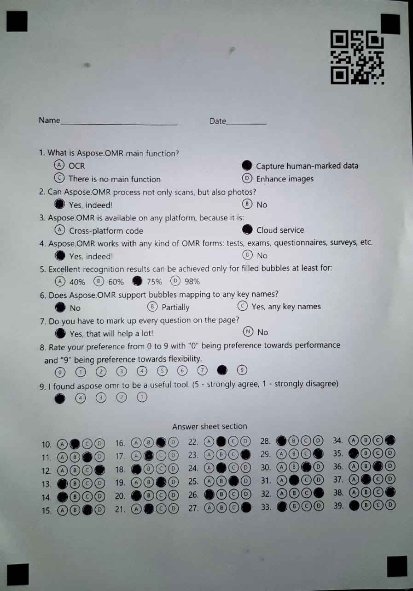
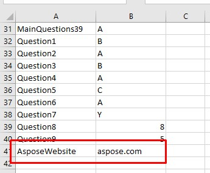

-----
Aspose.OMR for .NET is a simple and lightweight API that makes performing OMR operation on images a breeze. The upcoming examples demonstrate how easy it is to get started with performing OMR on images.
# **Perform OMR operation on Images**
Aspose.OMR for .NET provides simple to use features for performing OMR operation. For a simple OMR operation, you only need two things, the prepared template (special markers will be drawn over the user's form and the image(s) to perform OMR operation on. Aspose.OMR provides [TemplateProcessor.RecognizeImage()](https://apireference.aspose.com/net/omr/aspose.omr.api/templateprocessor/methods/recognizeimage) method that takes an image path and returns a string output. The following code sample shows the use of [OmrEngine](https://apireference.aspose.com/net/omr/aspose.omr.api/omrenginehttps://apireference.aspose.com/net/omr/aspose.omr.api/omrengine) and [TemplateProcessor](https://apireference.aspose.com/net/omr/aspose.omr.api/templateprocessor) to perform OMR operation on two images.


# **Perform OMR operation with a threshold setting**
Aspose.OMR provides a threshold setting to fine-tune the result of OMR according to your needs. You can set the value of the threshold from 0 to 100 depending on your requirements. By increasing the value of the threshold, the API becomes more strict regarding the highlighting of the answers. [TemplateProcessor.RecognizeImage()](https://apireference.aspose.com/net/omr/aspose.omr.api/templateprocessor/methods/recognizeimage) method takes threshold as the optional 2nd parameter with the default value of 0. The use of the threshold setting is demonstrated in the following code sample.


# **Perform OMR operation with Recalculation**
Aspose.OMR for .NET provides you with the ability to perform recalculation on the image during the OMR operation. There might be some cases where you might want to process an image multiple times by changing the threshold setting to get the desired result. In that case, you may want to process the image again by calling [TemplateProcessor.RecognizeImage()](https://apireference.aspose.com/net/omr/aspose.omr.api/templateprocessor/methods/recognizeimage). But Aspose.OMR for .NET provides a better way to do this by providing the [TemplateProcessor.Recalculate()](https://apireference.aspose.com/net/omr/aspose.omr.api/templateprocessor/methods/recalculate) method. This method takes the result of [TemplateProcessor.RecognizeImage()](https://apireference.aspose.com/net/omr/aspose.omr.api/templateprocessor/methods/recognizeimage) as the first parameter and an optional threshold. [TemplateProcessor.Recalculate()](https://apireference.aspose.com/net/omr/aspose.omr.api/templateprocessor/methods/recalculate) method improves the efficiency of image processing and saves time as represented by the following code sample.


# **Perform OMR operation with Barcode Recognition**
Aspose.OMR for .NET provides you with the ability to recognize barcodes during OMR operation by default. The sample code snippet performs OMR operation on an image containing a barcode. The following is the image of the source file used.

After the sample code snippet is executed, the barcode value is added at the end of the CSV file as shown in the following picture.

` `The following is the code snippet used for the demonstration of this feature.


