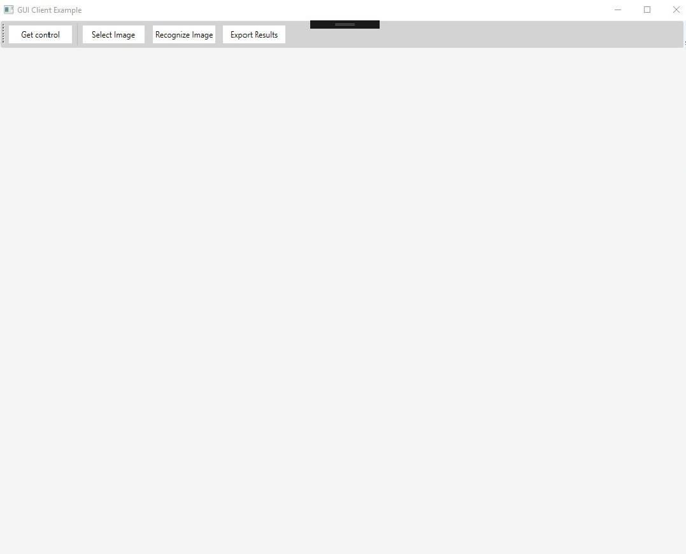
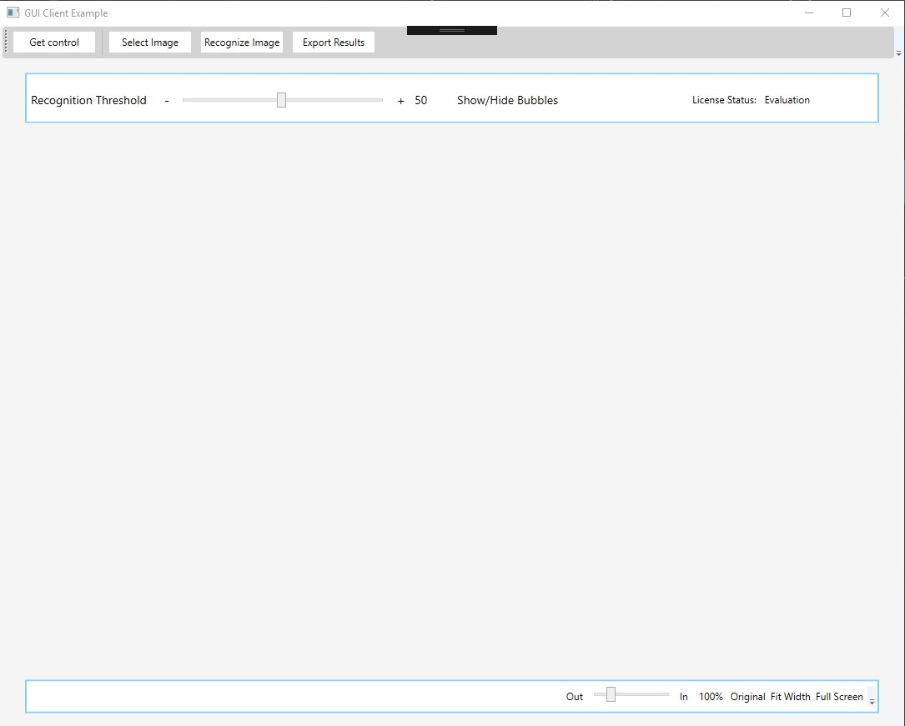
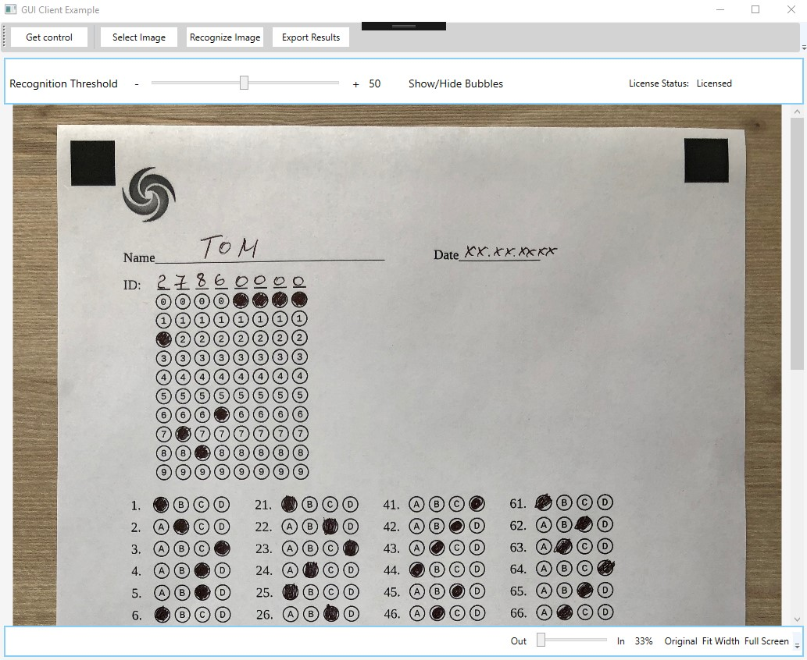
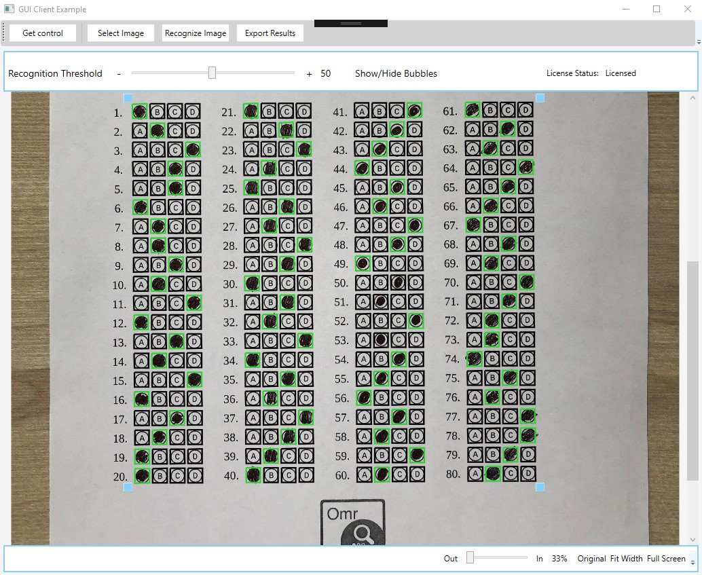
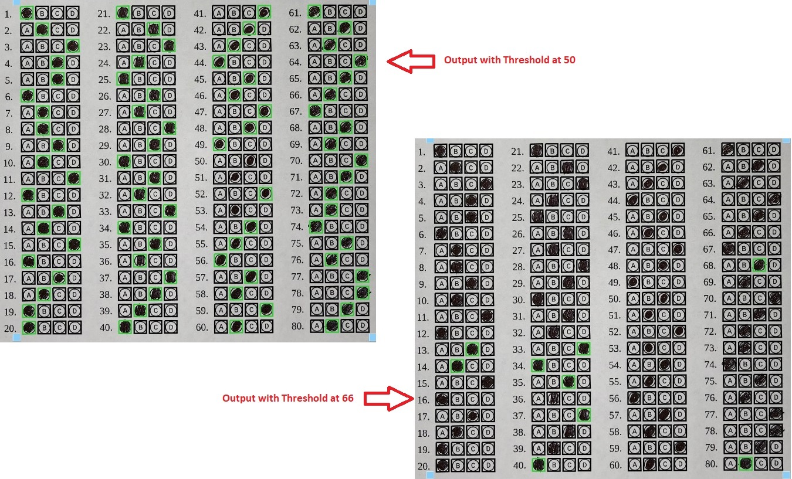
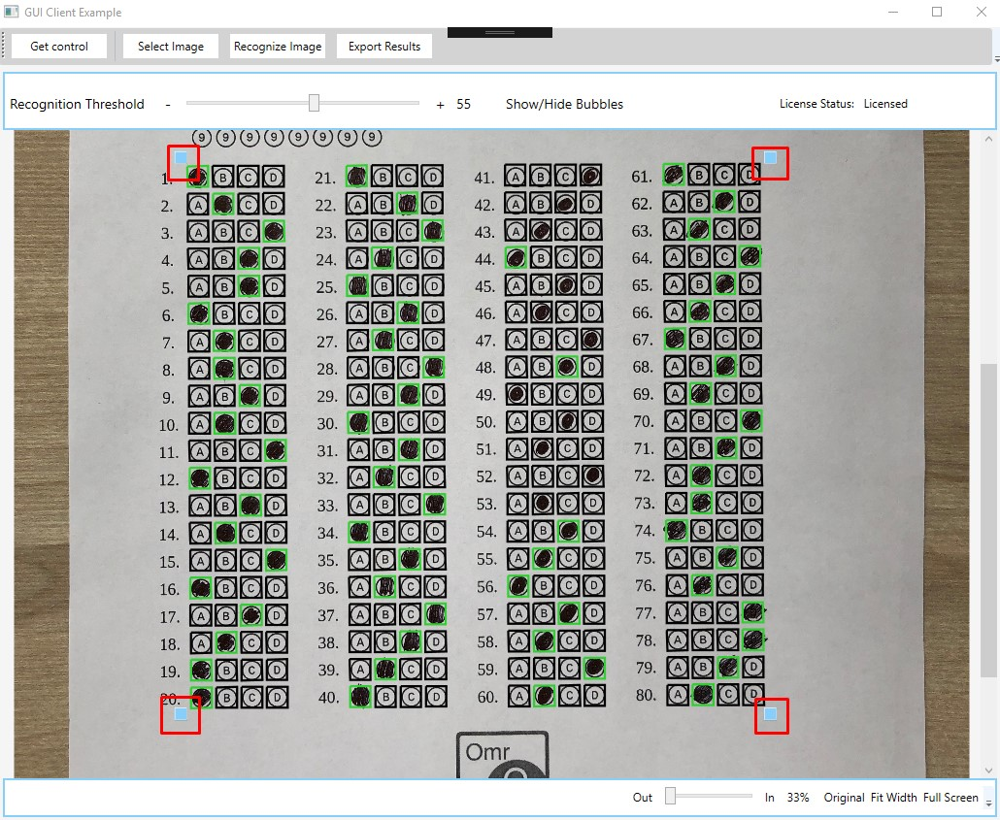

-----
Aspose.OMR for .NET is a simple and lightweight API that makes performing OMR operation on images a breeze. Aspose.OMR for .NET also provides a graphical control that can be added into .NET applications to manually correct threshold and markup and see the changes in real-time. The following guide explains in detail the use of the graphical control. A complete working example can be downloaded from [Aspose.OMR GitHub Repository](https://github.com/aspose-omr/Aspose.OMR-for-.NET).
# **Main Screen**
When you start the sample application, you are greeted with this startup screen. It has the following four buttons

- Get Control
- Select Image
- Recognize Image
- Report Results

# **Get Control**
Click the **Get Control** button to show the Aspose.OMR user control on the interface. 



Clicking the **Get Control** button executes the above-mentioned code snippet. [OmrEngine](https://apireference.aspose.com/net/omr/aspose.omr.api/omrengine) provides a [GetCorrectionControl](https://apireference.aspose.com/net/omr/aspose.omr.api/omrengine/methods/getcorrectioncontrol) method that accepts the [TemplateProcessor](https://apireference.aspose.com/net/omr/aspose.omr.api/templateprocessor) as a parameter and returns the content of the control. After the control is initialized, you get the following view.

The control displays the following

- Threshold Slider
- Show/Hide Bubbles Button
- License Status
# **Selecting Image**
Click the **Select Image** button and select the image to perform OMR operation on. After selecting the image, you get the following view that displays the image inside the control. The following code snippet is executed on **Select Image** button click.



# **Recognize Image**
Click the **Recognize Image** button to perform the OMR operation with the selected threshold on the image. The following code is executed on the **Recognize Image** button click.



After the OMR operation is done on the image, a grid with selected answers will be displayed on the image as shown in the following screenshot.

The green circles indicate the marked answers which have been recognized by the OMR engine.
# **Threshold Slider**
You may use the threshold slider to change how strict the API is to identify the answers. The following screenshot compares the images with the threshold setting of **50** and **66**. You can see that as the threshold value increased, the number selected answers decreased based on the quality of the highlighting.

# **Grid Alignment**
The control also provides four handles around the image for you to finetune the alignment of the grid on the image. You may move the handles to adjust the grid according to your requirements. The following screenshot shows the handles in the control.

# **Export Result**
When you are satisfied with the result of the image, you may export the results by clicking the **Export Results** button. The following code snippet is executed on the **Export Results** button click.



The output of the OMR operation will be saved as a CSV file.
